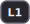
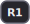
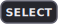
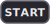
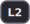
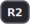

# SNESticle Revived

Revived and actively-maintained source of **SNESticle**, the long-rumored
**Super Nintendo (SNES) emulator** written by **Icer Addis (iaddis)**.

SNESticle was famously hidden inside the **GameCube** version of EA's
**Fight Night Round 2 (2005)**, where it ran **Super Punch-Out!!**. The
community reverse‑engineered and extracted that build in **2022**, and Sardu
released the source under the **MIT license**. This repository keeps that code
alive: reorganized into logical directories, fixed, extended, and made easy to
build and study today.

On top of the SNES core, the project now also integrates **InfoNES** to bring
**NES** emulation to the **PlayStation 2**.

> Primary target: **PlayStation 2** (EE/IOP, gsKit). Development is done on
> Debian via Termux — no full desktop required.

---

## Features

**Systems**
- **SNES** — the original SNESticle core (65816 ASM CPU, SPC700, PPU).
- **NES** — via **InfoNES** (`src/nes/`), with audio wired to the PS2 audio path.

**SNES special chips (coprocessors)** — clean‑room reimplementations, MIT‑safe:
- **DSP‑1 / DSP‑1B** — Pilotwings, Super Mario Kart, etc. (`sndsp1`)
- **DSP‑2** — Dungeon Master (`sndsp2`)
- **DSP‑3 / DSP‑4** — SD Gundam GX / Top Gear 3000, via the shared NEC
  uPD7725 **LLE** core (`sndsp1_lle`); requires the chip firmware dump
  (`dsp3.rom` / `dsp4.rom`, 8 KB) placed in `…/SNESticle/dsp/`.
- **CX4** — Mega Man X2 / X3 (`sncx4`)
- **OBC1** — Metal Combat (`snobc1`)
- **S‑DD1** — Star Ocean, Street Fighter Alpha 2 (`snsdd1`)
- **S‑RTC** — Daikaijuu Monogatari II (`snsrtc`)

**PlayStation 2 platform**
- gsKit‑based video backend with a **Video Config** screen.
- Multiple video modes: **480i** (default, universally compatible), **480p**
  (GSM / HDMI), **240p / 288p** (CRT), plus screen offset and widescreen.
- **Cover art** in the ROM browser — box art / screenshots from PNG files,
  decoded by **upng** (a bundled single‑file decoder, no external libs). See
  [Cover art](#cover-art-capas).
- **Menu music** — tracker tunes (`.mod` / `.xm`) play in the ROM browser and
  pause menu, with volume and synthesis‑rate controls. See
  [Menu music & audio](#menu-music--audio).
- Audio via **audsrv**, with separate **Game Volume** and **Menu Music**
  controls in the Video Config screen.
- Controller / memory‑card / IRX bring‑up aligned to **Open‑PS2‑Loader** style.
- **Storage**: USB (×2), external HDD/SSD and **MX4SIO** SD cards as
  `mass0:`/`mass1:`; the internal **HDD** (`hdd0:`); memory cards
  (`mc0:`/`mc1:`) including **MMCE** carts (MemCard PRO 2 / SD2PSX) as
  `mmce0:`/`mmce1:`. Reads FAT16/FAT32/**exFAT** with MBR/GPT partition
  tables via the bundled BDM stack. See [Storage & devices](#storage--devices).
- Netplay code (`src/modules/netplay/`).

---

## Controls

The PS2 pad maps to an SNES controller. **L2 + R2** (pressed together) toggles
between the game and the menu at any time.

**In a game**

| Button | SNES |
|:------:|------|
|  | D‑Pad |
|  | B |
|  | A |
|  | Y |
|  | X |
|  /  | L / R |
|  | Select |
|  | Start |
|  +  | Open the menu |

**Menu & ROM browser**

| Button | Action |
|:------:|--------|
|  Up / Down | Move the selection |
|  or  | Launch the highlighted ROM (or open a folder) |
|  | Go up one folder (`..`) |
|  | Page up — *or swap the cover image when cover art is on (see below)* |
|  | Page down |
|  | File menu (copy / paste / delete) |
|  /  | Switch screen (Browser ⇆ Network ⇆ Menu ⇆ Log) |
|  +  | Return to the game |

**Video Config screen**

| Button | Action |
|:------:|--------|
|  Up / Down | Select an option |
|  Left / Right | Change its value |
|  | Reset the screen offset |
|  or  | Save settings to the memory card |

---

## Cover art (capas)

The ROM browser can show box art / screenshots beside the game list.

- Enable it in **Video Config → Cover Art** (press ✕ to save — it persists
  across boots).
- Put a PNG with the **same name as the ROM** anywhere the browser looks:
  - **next to the ROM** — e.g. `Super Mario Kart (USA).png`
  - in the **libretro thumbnail folders** (beside the ROMs, or inside a
    `COVERS_PATH` folder): `Named_Boxarts/`, `Named_Titles/`, `Named_Snaps/`
  - with a **numeric suffix** for extra images: `Game-1.png`, `Game-2.png`, …
- Press **□** in the browser to cycle through whatever a game has, in order:
  box art → title screen → gameplay snap → extra `-N` images.
- To keep every cover in **one shared folder** instead of next to each ROM,
  build with `COVERS_PATH`:
  ```bash
  make COVERS_PATH=mass:/snes/covers
  ```
  Covers are then looked up under `mass:/snes/covers/` (including its
  `Named_Boxarts/` etc.), with the ROM's own folder as a fallback.
- When you build an ISO with `ROMS=`, PNGs in the ROM folder are bundled
  automatically.

**Supported PNG formats:** RGB / RGBA (8‑ or 16‑bit), grayscale, and
palette/indexed (1/2/4/8‑bit). **Interlaced (Adam7) PNGs are not supported** —
re‑save those as non‑interlaced. Keep covers small (≈256 px) to save memory and
decode time; they are cached in RAM and prefetched so browsing stays smooth.

---

## Menu music & audio

Background music plays in the ROM browser and the pause menu — tracker modules
in **`.mod`** (Amiga ProTracker) and **`.xm`** (FastTracker II) formats, decoded
on the EE by the bundled single‑file players **jar_mod** / **jar_xm**.

Drop one or more tracks in any of these folders (scanned **once** and cached in
RAM, so it never re‑hits the disk while you browse):

- the `BGM_PATH` folder (if you built with one — see below)
- `mc0:/SNESticle/bgm`, `mc1:/SNESticle/bgm`
- `mass:/SNESticle/bgm`, `mass:/bgm`
- `cdfs:/BGM` (inside the ISO)

A **random track** is picked at boot, and a **different one each time you leave
a game** and return to the menu (when more than one track is present).

**Video Config → Audio**

| Option | Range | Notes |
|--------|-------|-------|
| **Game Volume** | 0–100 | Loudness of the emulated SNES/NES audio. **100 = the default** (matches Snes9x); 0 mutes. Applies to both cores. |
| **Menu Music** | Off / 1–100 | Background‑music volume. **0 = Off** — the player isn't loaded and uses no RAM. Shows **No Track** when no `.mod`/`.xm` is found. |
| **Frequency** | 16–48 kHz | Synthesis rate of the menu music (the output is always resampled to 48 kHz). Higher = better quality but more CPU; **32 kHz** is the default and recommended. |

All three persist to the memory card (press ✕ to save), and work the same for
SNES and NES (the menu and audio path are shared).

To bake a default tracks folder or synth rate into the build:

```bash
make BGM_PATH=mass:/snes/bgm    # where to look for .mod/.xm first
make BGM_RATE=24000             # 16000/22050/24000/32000/38000/44100/48000
```

When building an ISO, add `bgm=` to bundle a folder of tracks (they land in
`cdfs:/BGM`):

```bash
make iso roms=/path/to/roms bgm=/path/to/tracks
```

> **Licenses:** `jar_mod` is public domain (CC0); `jar_xm` is WTFPL. Both are
> single‑header players vendored from raylib's `src/external`.

---

## Storage & devices

The ROM browser lists every storage device the build can reach. Pick one to
browse it. There are no build flags for this — it all comes up automatically
at boot.

| Device | What it is |
|--------|------------|
| `mass0:` / `mass1:` | **USB** (the PS2's two ports), USB **external HDD/SSD**, and **MX4SIO** SD cards — all block devices share the `massN:` namespace, numbered in detection order. |
| `hdd0:` | The **internal HDD** (PS2 Fat expansion bay), APA‑partitioned like HDD‑OSD / OPL. |
| `mc0:` / `mc1:` | **Memory cards** — including the original **MemCard PRO** (gen 1), which behaves as a normal card. |
| `mmce0:` / `mmce1:` | **MMCE** carts (**MemCard PRO 2**, **SD2PSX**) via `mmceman`. |
| `cdfs:` | The game/data disc (or the ISO this ELF was burned into). |

**Filesystems / partitions:** the bundled **BDM** stack (`bdm` + `bdmfs_fatfs` +
`usbmass_bd`) reads **FAT16 / FAT32 / exFAT** with **MBR or GPT** partition
tables (so drives larger than 2 TB work), mirroring modern OPL. The internal
HDD additionally uses `ps2atad` + `ps2hdd` for the APA `hdd0:` device.

> **Build note:** the USB/BDM and internal‑HDD modules are embedded from your
> `$(PS2SDK)/iop/irx`. `mmceman.irx` (MMCE) and `mx4sio_bd.irx` (MX4SIO) are
> **optional** — they are only baked in if your PS2SDK ships them, so a missing
> module never breaks the build (those entries just stay empty).
>
> Each storage module prints its load result on the boot splash
> (`bdm.irx = 0`, `hdd (hdd0:) = N`, …), so a failure is visible in a photo of
> the screen. On a console without an internal HDD the `dev9`/`hdd` probe just
> reports "no hardware" and boot continues — it does not hang.

---

## Building (PlayStation 2)

You need **PS2SDK** installed. Follow the
[ps2dev](https://github.com/ps2dev/ps2dev.git) instructions and use the
**latest** PS2SDK.

```bash
cd ~/SNESticleRevive

# Just build the ELF
make                 # single worker
make JOBS=3          # parallel build (3 workers)

# Build a bootable ISO with a ROM folder and copy everything out
make iso ROMS=/path/to/roms OUT=/path/to/output JOBS=3

# See every option
make help

# Clean build folder
make clean
```

Produces `SNESticle.elf` (and a packed ELF / ISO for the `iso` target).

### Handy build flags

| Flag | What it does |
|------|--------------|
| `JOBS=N` | Number of parallel compile workers (also honored by `make iso`). |
| `VERBOSE=1` | Show the **full** warning/error text (no truncation). |
| `PROFILE=1` | Compile the on‑screen profiler in — press **R3** in‑game to capture one frame's per‑section timing. |
| `OUT=/path` | Copy the final ELF/ISO to this folder. |
| `ROMS=/path` | ROM folder to embed when building an ISO. |
| `PACK=0` | Build the ISO using the unpacked ELF. |
| `COVERS_PATH=path` | Shared cover‑art folder baked into the build (e.g. `mass:/snes/covers`). See [Cover art](#cover-art-capas). |
| `BGM_PATH=path` | Folder scanned first for menu‑music `.mod`/`.xm` files. See [Menu music & audio](#menu-music--audio). |
| `BGM_RATE=hz` | Default menu‑music synthesis rate (e.g. `32000`). |

> Note: changing a flag like `PROFILE=1` does **not** force a recompile on its
> own (make only tracks file timestamps). Run `make clean` first when toggling
> compile flags.

---

## What's been done recently

- **Coprocessors**: added DSP‑1, DSP‑2, CX4, OBC1, S‑DD1 and S‑RTC, each
  written clean‑room and verified bit‑exact host‑side against public references
  before being committed (no GPL/Snes9x code in this MIT repo).  DSP‑3 / DSP‑4
  are handled by a clean‑room NEC uPD7725 **low‑level** core that runs the
  chip's own microcode from a firmware dump (no math reproduced from emulators).
- **NES (InfoNES) integration**: full PS2 platform layer (render, input, audio,
  one‑frame stepper), with the InfoNES core kept 1:1 with upstream.
- **Video**: gsKit migration, the Video Config screen, multiple modes, and a
  **safe 480i default** (240p stays available for CRT users).
- **Cover art**: the ROM browser shows box art / screenshots from PNG files,
  via a bundled single‑file decoder (RGB/RGBA, grayscale, and palette/indexed).
  Decoded covers are kept in a small RAM cache and neighbours are prefetched, so
  browsing stays smooth even from a CD; toggle it in Video Config, point it at a
  shared folder with `COVERS_PATH`, and cycle box/title/gameplay with □.
- **Menu music & audio controls**: tracker music (`.mod` / `.xm`) plays in the
  ROM browser and pause menu via bundled single‑file players (jar_mod / jar_xm),
  decoded on the EE and resampled to the SPU2's 48 kHz. Added **Game Volume**,
  **Menu Music** volume (0 = off, frees its RAM) and a synthesis **Frequency**
  picker in Video Config — all persisted, shared by SNES and NES. A random track
  plays at boot and a new one each time you leave a game.
- **Storage**: a modern **BDM** stack (embedded from PS2SDK) replaces the old
  single‑USB path — two USB ports, external HDD/SSD and MX4SIO all appear as
  `mass0:`/`mass1:`, reading FAT16/FAT32/exFAT with MBR/GPT. Added the internal
  HDD (`hdd0:`, APA) and MMCE carts (`mmce0:`/`mmce1:`, MemCard PRO 2 / SD2PSX).
  See [Storage & devices](#storage--devices).
- **Boot / input**: controller and IRX bring‑up reworked to behave on real
  hardware, not just emulators.
- **Build system**: parallel jobs, `VERBOSE`, `PROFILE`, friendlier `make help`,
  and ISO builds that honor `JOBS`.
- **Bug fixes**: C++17 / build warnings cleaned up, plus three real
  out‑of‑bounds bugs fixed in the InfoNES core (`APU_Reg`, mapper 19 & 45 arrays)
  and a sequence‑point UB fixed in the 6502 core.

---

## Known issues / still missing

**SNES**
- **Final Fight 2** — large (32×32) / page‑1 object sprites render garbled. The
  OBJ fetch/render path has been verified correct against hardware references
  (bsnes/Anomie) and host‑side; the cause is suspected to be the VRAM
  data/upload feeding it. **Under investigation.**
- Some large / special‑chip titles may still freeze or misbehave.
- **Missing chips**: SA‑1 and SuperFX (GSU) are not implemented.

**NES (InfoNES)**
- **Performance**: heavy scenes can push a frame over the 16.6 ms budget, which
  vsync then locks to **30 fps**; this also knocks audio and per‑scanline
  effects out of sync. (Use `PROFILE=1` + R3 to locate hotspots.)
- **Super Mario Bros 3** — the MMC3 status‑bar split can glitch when scrolling
  (InfoNES uses a scanline‑approximated MMC3 IRQ, not A12‑accurate).
- Audio timing can be off until the game settles (related to the 30 fps issue).

**Video**
- **240p is not a standard HDMI/DTV mode** — passive PS2→HDMI adapters and most
  modern TVs will not lock onto it (no signal). The default is **480i**; pick
  240p in the Video Config screen only on a CRT or a 240p‑capable scaler.

> Some bugs only reproduce on **real PS2 hardware** (emulators like NetherSX2 /
> PCSX2 are more forgiving), which makes them harder to track down.

---

## Project layout

```
src/snes/      SNES core (cpu, spc, ppu, coprocessors)
src/nes/       NES core (InfoNES: core, cpu, apu, mappers, system)
src/platform/  PlayStation 2 platform (gs, system, input, ui)
src/modules/   shared modules (audio, netplay, ...)
src/common/    shared helpers (render, base, io, debug)
tools/         host‑side test harnesses (chip + OBJ verification)
```

---

## Credits

- **[iaddis/SNESticle](https://github.com/iaddis/SNESticle)** — Icer Addis, the original emulator.
- **[tmaul/SNESticle](https://github.com/tmaul/SNESticle)** — many later improvements.
- **[Wolf3s/SNESticle](https://github.com/Wolf3s/SNESticle)** — fork used as one of the bases for this repository.
- **Sardu** — for releasing the recovered source under the MIT license (2022).
- **[jay-kumogata/InfoNES](https://github.com/jay-kumogata/InfoNES)** — the NES core integrated here.
- **[upng](https://github.com/elanthis/upng)** — Sean Middleditch & Lode Vandevenne; the bundled single‑file PNG decoder used for cover art (zlib license). Extended in this repo with palette/indexed support.
- **jar_mod / jar_xm** — Joshua Reisenauer (jar_xm based on **libxm** by Romain "Artefact2" Dalmaso); the bundled single‑file `.mod` / `.xm` tracker players used for menu music (public domain / WTFPL), vendored from raylib's `src/external`.
- **[hugorsgarcia/PS2SNESticle](https://github.com/hugorsgarcia/PS2SNESticle)** — **Hugo Garcia**, whose PS2 work was the reference for the controller / memory‑card / IRX bring‑up and the netplay module.
- **Open‑PS2‑Loader**, **picodrive‑PS2** and **uLaunchELF** — references for correct PS2 boot, IOP and video behavior.
- **ReyFxck** — this revival/fork and ongoing development.
- **Adriano Oliveira** — real‑hardware testing.
- **Control‑prompt icons** (`docs/controls/*.svg`) — original SVGs drawn for this repo; reuse freely.

---

## License

MIT — see [`LICENSE`](LICENSE).

## TODO

- [ ] **[PS2]** Replace precompiled IRX modules with PS2DEV‑generated ones. *(hard)*
- [ ] **[PS2]** Replace libcdvd with the latest PS2DEV libcdvd. *(medium)*
- [x] **[PS2]** Update the Makefile for newer PS2SDK versions.
- [ ] **[PS2]** Finish moving custom GS code to gsKit where possible. *(ongoing)*
- [ ] **[NES]** Profile and bring heavy scenes back to a stable 60 fps.
- [ ] **[SNES]** Track down the Final Fight 2 sprite data/upload bug.

<sub>Yes, we still have a lot of free time :)</sub>
